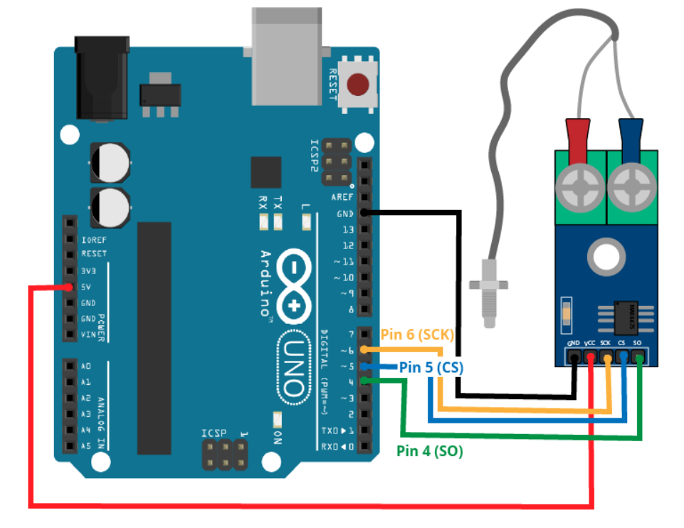
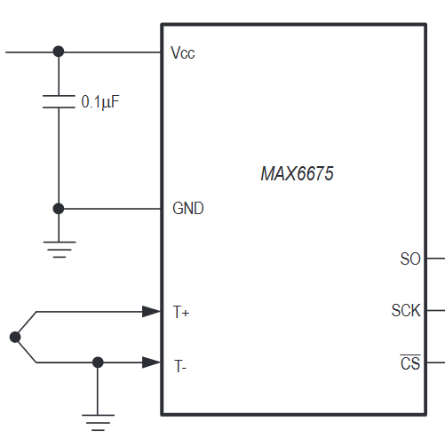

# Control de Servo y Registro de Temperatura para Nanomateriales en PTT

---

## Descripción General

Este proyecto incluye la visualización en tiempo real y registro de datos de **temperatura a través de una termocupla conectada al módulo MAX6675**. La adquisición de datos se puede realizar de **forma manual o por tiempo definido**. Además, se incluye la **opción de ciclos que rigen el funcionamiento de un servo** utilizado específicamente para el montaje experimental del **análisis de temperatura de un nanomaterial implementado en PTT (Photothermal Therapy)**. La carpeta `arduino_nano_config` incluye el código subido al microcontrolador Arduino Nano utilizado. Sin embargo, es posible implementar el uso de otro microcontrolador a través de comunicación serial.


## Características Principales

* **Adquisición de Temperatura en Tiempo Real**: Utiliza una termocupla con módulo MAX6675 para mediciones precisas.
* **Visualización Dinámica**: Gráfica en vivo de temperatura vs. tiempo y visualización numérica de la temperatura actual y tiempo transcurrido.
* **Control de Registro Flexible**:
    * **Registro Manual**: Inicia y detiene la grabación de datos en un archivo `.csv` a tu discreción.
    * **Registro por Tiempo Definido**: Configura una duración específica para que el registro se detenga automáticamente.
* **Modos de Control de Servo (Para PTT Experimental)**:
    * **Modo Manual**: Control directo para abrir y cerrar el servo.
    * **Modo de Ciclos**: Automatiza la operación del servo para experimentos repetitivos de calentamiento/enfriamiento.
* **Adaptabilidad del Microcontrolador**: Aunque incluye configuración para Arduino Nano, el diseño permite la integración con otros microcontroladores vía comunicación serial.
* **Gráfico de datos con MatplotLib**: Al finalizar una toma de datos el programa pregunta si se desean graficarlos.

---

## Modos de Control

### Modo Manual

Esta función permite el control de un **servo** conectado a un microcontrolador. El servo es utilizado para la **obstrucción de la incidencia de un láser en una muestra** donde el sensor termocupla está inmerso, por lo que podría no utilizarse la función de servo si no es necesaria para el experimento. También, permite **iniciar y finalizar el registro de datos** en un archivo `.csv` bajo control directo del usuario.

### Modo de Ciclos

Esta función implementa el uso del **servo** como se mencionó anteriormente, para la **obstrucción de la incidencia de un láser en una muestra** donde el sensor termocupla está inmerso. Los ciclos implican que la muestra **suba de temperatura** al tener la incidencia del láser y **baje de temperatura** sin la incidencia del láser. Con ello es posible seleccionar la **cantidad de ciclos** y la **duración de cada intervalo**.

#### Ciclo e Intervalo

Un **ciclo** considera la siguiente secuencia de eventos:
1.  **Abrir el servo** (permite la incidencia del láser).
2.  **Esperar la duración del intervalo** (tiempo de calentamiento de la muestra).
3.  **Cerrar el servo** (obstruye la incidencia del láser).
4.  **Esperar la duración del intervalo** (tiempo de enfriamiento de la muestra).

#### Opciones "Iniciar Ciclos" y "Detener Ciclos"

* **Iniciar Ciclos**: Comienza la ejecución de la cantidad de ciclos seleccionada. Al activarse, permite elegir el nombre del archivo `.csv` a guardar para registrar los datos durante los ciclos.
* **Detener Ciclos**: Permite interrumpir los ciclos iniciados en cualquier momento y, si el registro de datos fue iniciado por los ciclos, también lo detiene.

---

## Datos en Vivo

En la interfaz de usuario, se puede observar la **temperatura actual** reportada por el sensor y el **tiempo transcurrido** desde el inicio del monitoreo o el último registro de datos. El contador de tiempo transcurrido se reinicia automáticamente con cada nuevo inicio de registro de datos.

---

## Conexión Serial

La aplicación detecta y permite seleccionar los puertos seriales disponibles para establecer comunicación con el microcontrolador Arduino. Esto asegura una conexión estable para la adquisición de datos y el envío de comandos al servo.

---

## Requisitos

### Hardware
* **Arduino Nano** (o cualquier placa Arduino compatible).
* **Módulo Termocupla MAX6675** con su termocupla tipo K.
* **Servo Motor** (ej. SG90).
* **Cable USB** para la conexión Arduino-PC.
* **Montaje Experimental** específico para PTT (láser, soporte de muestra, etc.).

### Software
* **Python 3.x** (versión 3.8 o superior recomendada).
* **PyQt5**: Para la interfaz gráfica de usuario.
* **Matplotlib**: Para la visualización de gráficas en tiempo real.
* **Pyserial**: Para la comunicación serial entre Python y Arduino.
* **Arduino IDE**: Para programar el microcontrolador.

---

## Instalación

1.  **Clona este repositorio** o descarga los archivos del proyecto.
    ```bash
    git clone https://github.com/JaimeCari/MAX6675_Temperature_Data_Reader.git
    ```

2.  **Instala las dependencias de Python**:
    ```bash
    pip install PyQt5 matplotlib pyserial
    ```

3. **Montaje del circuito**

4.  **Preparar Arduino Nano**:
    * Abre el archivo `arduino_nano_config/arduino_firmware.ino` en el **Arduino IDE**.
    * Asegúrate de tener instaladas las librerías necesarias para el MAX6675 (ej. `Adafruit_MAX6675.h`) y el Servo (`Servo.h`). Puedes instalarlas desde el "Administrador de Librerías" del Arduino IDE.
    * Conecta tu Arduino Nano a tu PC.
    * Selecciona la placa **Arduino Nano** y el **puerto COM/Serial** correcto en el menú **Herramientas** del Arduino IDE.
    * Sube el código al Arduino Nano.
    * En caso de tener problemas de conexión entre Arduino IDE y el microcontrolador se debe seleccionar la siguiente opción.
    En Tools/Herramientas probar los distintos Processor/Procesador presentes (En el caso del Arduino UNO utilizado funcionaba el ATmega328P Old Bootloader). Recuerde instalar previamente los drivers correspondientes al Arduino. **Nota** al cargar un nuevo código al Arduino **cerrar** el Serial Monitor

5. **Ejecución del programa**:
    ```bash
    python main_app.py
    ```

---

## Circuito
### Circuito simplificado

**Fuente**: https://randomnerdtutorials.com/arduino-k-type-thermocouple-max6675/

### Implementación del circuito con capacitor en alimentación


---

## Uso

1.  **Asegúrate de que tu Arduino Nano esté conectado** y el firmware cargado correctamente.
2.  **Ejecuta la aplicación de Python**:
    * Abre tu terminal o símbolo del sistema.
    * Navega a la carpeta raíz del proyecto donde se encuentra `main_app.py`.
    * Asegúrate de que tu entorno virtual esté activado.
    * Ejecuta:
        ```bash
        python main_app.py
        ```
3.  **Conexión en la Interfaz**:
    * En la sección "**Conexión Serial**", selecciona el puerto COM/Serial correspondiente a tu Arduino Nano. Si no aparece, haz clic en "**Refrescar Puertos**".
    * Haz clic en el botón "**Conectar**".
4.  **Experimentación y Registro**:
    * Utiliza los controles en las secciones "**Control Manual y Registro**" y "**Modo de Ciclos (Servo)**" para interactuar con tu montaje experimental y registrar los datos de temperatura.
    * Recuerda el botón `?` junto a la "Duración (segundos)" para obtener ayuda sobre el registro de tiempo.

---

## Estructura del Proyecto
1. **main_app.py**: Script principal para iniciar la aplicación.
2. **app_gui.py**: Define la interfaz de usuario y la lógica principal.
3. **serial_handler.py**: Maneja la comunicación serial (lectura de datos, envío de comandos).
4. **app_params.py**: Parámetros de configuración (constantes, encabezados CSV).
5. **arduino_nano_config/**:
   * arduino_firmware.ino: Código fuente del firmware para Arduino Nano (MAX6675 y Servo).
6. **README.md**

## Fuentes y recursos utilizados
1. **Arduino: K-Type Thermocouple with MAX6675 Amplifier. Random Nerd Tutorials**: https://randomnerdtutorials.com/arduino-k-type-thermocouple-max6675/
2. **Termopar Tipo K con PIC 🔥 CCS C y MAX6675 # 045**: https://www.youtube.com/watch?v=jPWzH1l8c34

**Nota Importante:** Este proyecto es de **libre uso** y puede ser modificado y distribuido sin restricciones. El código incluido puede contener secciones generadas o asistidas por herramientas de inteligencia artificial. Cualquier Feedback es bienvenido.